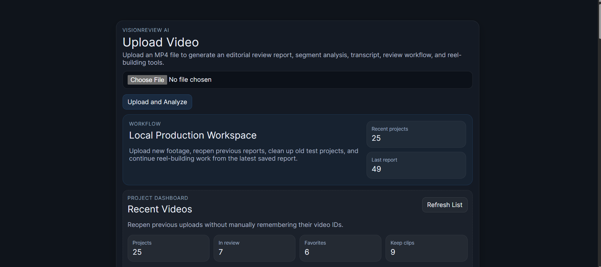
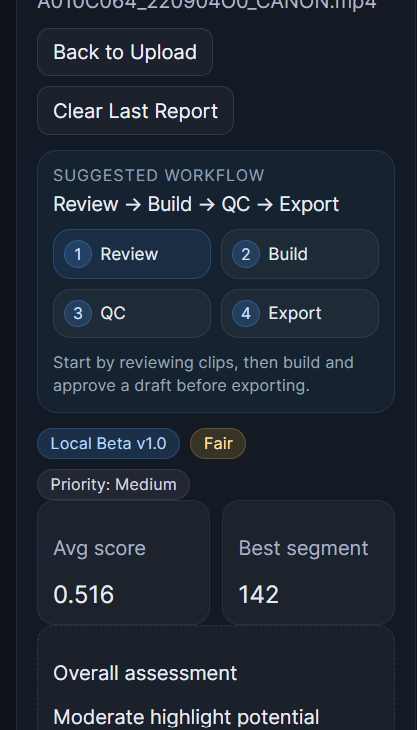
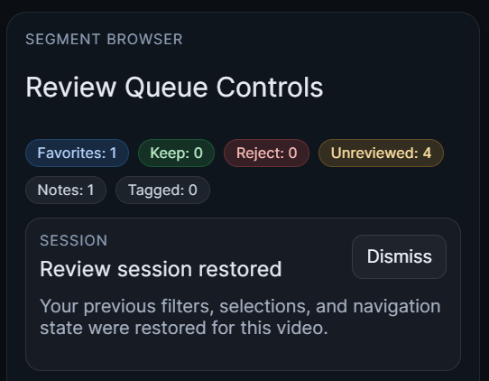
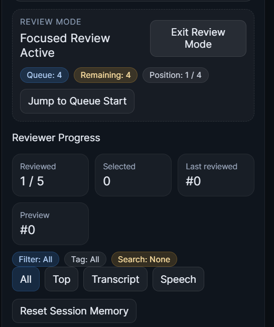
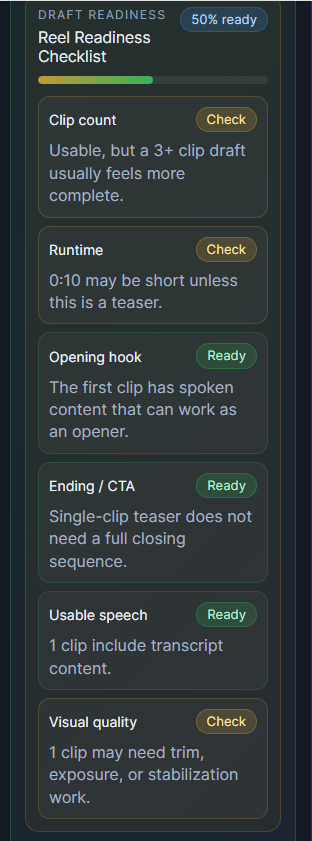
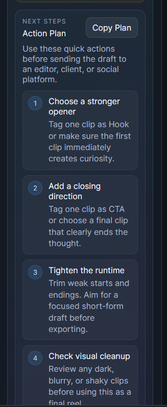
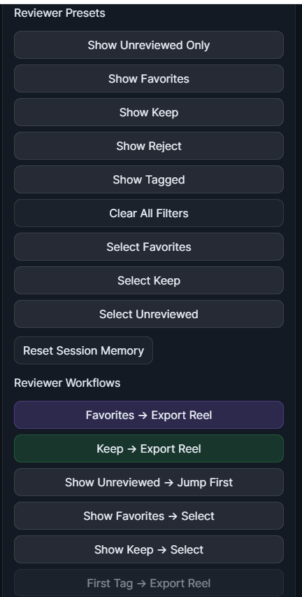
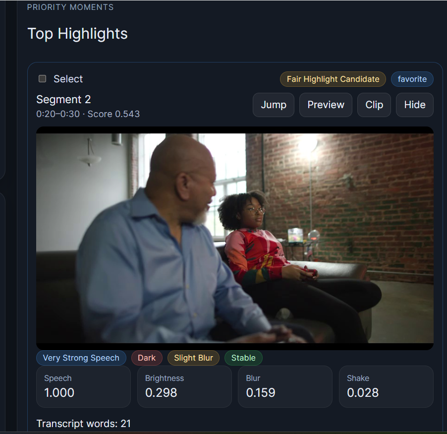

# VisionReview AI — Public Showcase

## AI-Assisted Video Review and Editorial Workflow

VisionReview AI is an AI-assisted video review and editorial workflow system designed to help editors, creators, and production teams move from raw footage to reviewed selects, structured reel drafts, quality-control notes, and export-ready handoff packages.

This public repository is a **showcase version** of the project. The full working source code is kept private while the project is evaluated for commercial development.

---

## Project Status

```text
Status: Local Beta v1.0
Full Source: Private
Public Repo Type: Showcase / Portfolio
```

---

## Product Preview

### Dashboard

The dashboard provides upload access, recent project management, search, filtering, sorting, and local beta readiness information.



---

### Report Overview

The report view combines video playback, segment analysis, transcript excerpts, review controls, and export tools in one editorial workspace.



---

### Segment Review

Editors can mark clips as Favorite, Keep, Reject, or Unreviewed, then add notes and tags for downstream reel building.



---

### Review Mode

Review Mode creates a focused workflow for moving through segments quickly with a sticky action bar, quick decisions, quick tags, and quick notes.



---

### Reel Builder — Plan

The Plan tab recommends a draft, summarizes readiness, and gives a clear next-step workflow.



---

### Reel Builder — Order

The Order tab lets an editor manually arrange clips before export.



---

### Reel Builder — Presets

The Presets tab provides platform and delivery guidance for Instagram, TikTok, YouTube Shorts, client review, and editor handoff.



---

### Client Review

The Client tab creates a cleaner client-facing review summary from Favorite and Keep clips.



---

### QC and Approval

The QC tab checks export readiness, warnings, draft approval, and approval notes.


---

### Project Package Export

VisionReview AI can export a structured project package containing report data, review CSV, transcript, summary, and media inventory.


---

## Problem Statement

Video editors, content creators, and production teams often spend significant time:

- Scrubbing raw footage
- Finding usable moments
- Taking review notes
- Organizing selects
- Creating short-form reel drafts
- Preparing client review summaries
- Exporting production handoff documents

VisionReview AI explores how AI-assisted media analysis can support that workflow by combining video processing, transcription, highlight scoring, human review, reel planning, and export packaging into one local application.

---

## Core Workflow

```text
Upload → Analyze → Review → Build Reel → QC → Approve → Export
```

---

## Feature Overview

VisionReview AI includes:

- MP4 upload
- Video analysis and segmentation
- Transcript generation
- Highlight scoring
- Human review decisions
- Notes and tags
- Review Mode
- Reel Builder
- Client Review View
- QC and approval workflow
- Project Package export
- Recent Videos dashboard

---

## Reel Builder

The Reel Builder includes:

```text
Plan | Order | Presets | Client | Timeline | Copy | Handoff | Compare | QC
```

These tools support:

- Draft planning
- Clip ordering
- Delivery presets
- Client review summaries
- Editor timeline notes
- Posting copy
- Handoff briefs
- Candidate comparison
- QC and approval checks

---

## Technology Stack

### Backend

- FastAPI
- SQLite
- SQLAlchemy
- OpenCV
- FFmpeg
- Whisper transcription

### Frontend

- React
- Vite
- CSS
- jsPDF

---

## Architecture Overview

High-level architecture:

```text
React + Vite Frontend
        ↓
FastAPI Backend
        ↓
SQLite / SQLAlchemy
        ↓
OpenCV + FFmpeg + Whisper
        ↓
Reports, Review Data, Clips, Reels, Project Packages
```

See:

```text
docs/architecture-overview.md
```

---

## Sample Workflow

1. Upload an MP4 file.
2. Let the backend analyze and segment the video.
3. Review generated segments.
4. Mark strong clips as Favorite or Keep.
5. Add notes and tags.
6. Use Reel Builder to create a draft.
7. Check the draft in QC.
8. Approve the draft.
9. Export a reel or project package.

---

## Public Showcase Note

This repository does **not** include the full working backend or frontend source code.

The full implementation is kept private to protect:

- Product implementation
- Backend architecture
- UI workflow
- Highlight scoring logic
- Reel Builder workflow
- QC and approval logic
- Export pipeline
- Commercial roadmap

---

## Demo Video

```text
Coming soon
```

Recommended demo title:

```text
VisionReview AI Local Beta v1.0 — AI-Assisted Video Review Workflow
```

---

## Roadmap

Potential future directions include:

- Desktop app packaging
- Cloud storage
- Hosted database
- Authenticated user workspaces
- Background video processing
- Client review portal
- Export presets
- Billing and usage limits
- SaaS deployment

See:

```text
docs/roadmap.md
```

---

## Repository Notice

Copyright © 2026 M Henning. All rights reserved.

This repository is provided for portfolio and demonstration purposes only. No permission is granted to copy, modify, distribute, sublicense, or use this project commercially.

The full working source code is not included in this public showcase repository.
